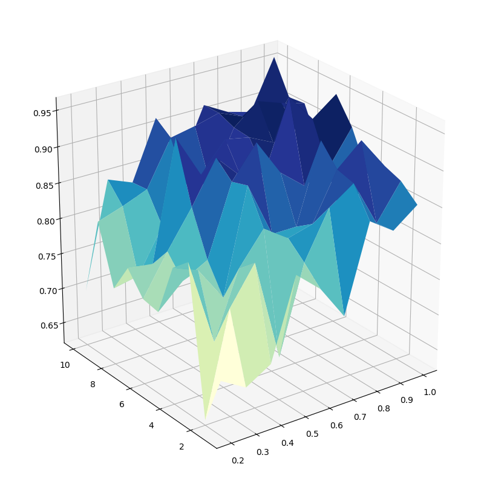

# 决策树的实现与测试

王梓涵 517021911179


## 摘要

决策树在机器学习领域有着广泛的应用。在算法与复杂性课程中，介绍了决策树的相关算法。本文在该课程所介绍算法的基础上，进行了实现与测试工作。所实现了程序涉及了 ID3、C4.5 以及随机森林三种决策树算法。使用了经典的 MONK 数据集对实现的决策树进行了测试，并对测试数据进行了分析，对算法进行了评价。


## 理论概述

决策树是用树状图的形式来描述条件判断规则的一种方式。树中的内部节点表示对某一属性的“测试”，分支表示测试的结果，叶子节点表示分类标记。

常见的决策树学习算法，其基本思路都是类似的：给定一组训练样例，对于树中的某个节点，利用统计方法计算每种属性单独分类训练样例的能力，选取分类能力最好的属性作为该节点的测试属性。然后为该属性的每个可能值产生一个分支，将适当的训练样例分配到适当的分支下。递归地执行此过程，直到每个分支下的训练样例属于同类为止。

不同的决策树学习算法主要差异在于对样本分类能力的属性的判断标准不同。ID3 算法使用信息增益 $\mathrm{g}(D,A)​$ 来对属性进行评价：
$$
\mathrm{g}(D,A) = \mathrm{H}(D)-\mathrm{H}(D|A)\
$$
其中 $\mathrm{H}(D)​$ 为样本决策 $D​$ 分布的信息熵，$\mathrm{H}(D|A)​$ 为给定属性 $A​$ 条件下样本决策 $D​$ 分布的条件熵。

C4.5 算法则使用了信息增益率 $\mathrm{g}_R(D,A)​$ 来评价属性：
$$
\mathrm{g}_R(D,A) = \frac{\mathrm{g}(D,A)}{\mathrm{H}_A(D)}
$$
其中 $\mathrm{H}_A(D)$ 为分裂信息熵：
$$
\mathrm{H}_A(D) = -\sum_{i=1}^n \frac{|D_i|}{|D|}\log\frac{|D_i|}{|D|}
$$

在 $\mathrm{H}_A(D)​$ 的表达式中，$D_1, D_2, ... , D_n​$ 为根据属性 $A​$ 对样本集 $D​$ 分割形成的 $n​$ 个样本子集，每个子集中具有相同的 $A​$ 的取值。

随机森林是将多个决策树集成的一种策略。它对每个决策树的决策结果进行集成，来最终得到准确率更高的决策结果。要获得好的决策结果，每个个体要有一定的准确率，同时个体之间要有差异性。其中一种方法称为 bagging：对给定的训练集，在训练每个决策树时有放回地随机抽取某些样本，在集成时使用投票方式取得最终结果。


## 程序实现

本文所描述的程序代码是使用 Go 语言编写的，该语言简洁明了，既具有类似脚本语言的灵活性，又能提供严格的编译期类型与内存访问检查，且编译得到的程序具有较高的运行速度。

本文所描述的程序，以不到三百行的总代码量紧凑、高效地实现了 ID3、C4.5 以及随机森林三种决策树算法。下面将从接口设计、存储实现和运算实现三个角度阐述该程序的实现思路。

### 接口设计

抽象的决策树 `DecisionTree` 包含三个方法：`Train([]Instance)` 方法用于训练决策树，其接受样本实例 `Instance` 的切片（该结构体稍后会作介绍）；`Decide(Instance) int` 方法用于对测试实例进行决策，它接受一个样本实例作为参数，通过现有决策树来给出决策结果，其结果可能和测试实例本身的决策不同；`Print()` 用格式化的方法在控制台打印出生成的树的结构。

### 存储实现

首先介绍样本实例结构体 `Instance`，其包含成员有：决策结果 `decision` 和属性列表 `attrib`，其中 `decision` 为整数类型，`attrib` 为整型数组。任何离散的决策和属性，都可以转换为整数表示，所以该结构是合理的。

无论决策树的算法如何，其节点的结构总是相同的，所以可以定义公共的树节点 `TreeNode`。它包含成员有：节点类型标记 `flag`、决策结果 `decision`、决策属性索引 `iAttrib` 以及子节点列表 `children`。`flag` 是枚举类型成员，决定了该节点是叶子节点 `LeafNode` 还是内部节点 `InteriorNode`。如果 `flag` 为 `LeafNode`，那么其 `decision` 成员是有效的，表示沿一条决策路径走到终点的决策结果。如果 `flag` 为 `InteriorNode`，那么其 `iAttrib` 和 `children` 成员是有效的，`iAttrib` 成员表示决策属性在 `Instance` 的 `attrib` 数组中的索引。`children` 为一查找表，以决策属性的所有取值为键，对应决策分支上的子节点。

### 运算实现

决策树的运算核心在于统计，只有进行正确的统计，才能对属性进行合理的评价，从而构造出高效的决策树。这里选取 ID3 的训练过程进行分析。首先要统计的是所有样本 $D$ 在决策上的分布，这一步既能检测是否存在样本的决策全部相同，从而可以建立叶子节点、进行递归回溯，也能为计算样本决策分布的信息熵 $\mathrm{H}(D)$ 提供信息。而要计算条件熵 $\mathrm{H}(D|A)$，则需要对每个属性 $A_i \in \mathbb{A} = \{A_1, A_2, ... , A_m\}$ 进行遍历。对于一个属性 $A_i$，需要找出其每个取值 $a_{i, j} \in A_i = \{a_{i, 1}, a_{i, 2}, ..., a_{i, n}\}$ 所对应的样本实例，把它们放到一个列表 $L_{i, j}$ 当中。然后再对 $L_{i, j}$ 进行遍历，统计该属性在取一特定值时样本决策的分布 $D|A_i=a_{i, j}$。这样只要找到一个 $i$ 使得 $\mathrm{g}_R(D|A_i)$ 最大即可，对于一个节点其时间复杂度为 $O(|D||\mathbb{A}|\max\limits_{1\le i \le m}\{|A_i|\})$。而对于整棵树而言，复杂度为  $O(|D|\log|D|\cdot|\mathbb{A}|\max\limits_{1\le i \le m}\{|A_i|\})$。具体的训练函数就是上述方法的代码表达，这里不再赘述。

将 ID3 算法扩展到另外两种算法是相当便利的。C4.5 算法只需要额外计算 $\mathrm{g}_R(D|A_i)$ 即可，注意到 $|D_{i, j}|= |L_{i, j}|$，所以 $|D_{i, j}|$ 已经求过了。 而对于随机森林，只要其维护一个 `DecisionTree` 接口的列表 `trees` 就可以了，其额外做的只有在训练函数 `Train()` 中随机采样分发给各个决策树，以及在决策函数 `Decide()` 中集成结果即可。


## 数据测试

### 数据集

本文中所描述的测试，使用的是机器学习中经典的 MONK's Problem 数据集。自从 1991 年起，机器学习研究者使用该数据集测试过多个分类器模型。使用该数据集，既可以保证数据的有效性，又便于和已有的测试做对比，以验证本文所描述的决策树程序的正确性。MONK's Problem 数据集来自于机器人制造领域，训练集的每个实例就是一个机器人，每个机器人用六个属性描述：

| 序号 | 属性名     | 取值                 |
| ---- | ---------- | -------------------- |
| 1    | 头部形状   | {圆形，方形，八边形} |
| 2    | 身体形状   | {圆形，方形，八边形} |
| 3    | 是否微笑   | {是，否}             |
| 4    | 拿着的东西 | {剑，气球，旗子}     |
| 5    | 外套颜色   | {红，黄，绿，蓝}     |
| 6    | 是否有领带 | {是，否}             |

现在要判断一个机器人是否属于一特定类别，可以通过某一特定标准，给这些机器人打上是否属于该类别的标记，将一部分数据给分类器训练，另一部分数据用来测试分类器的正确率。该数据集中一共有 432 个不同属性的机器人，由于分类标准的不同，可以生成三组不同的测试数据：

* **第一组：（头部形状和身体形状相同）或（外套为红色）**

  124 个实例作为训练集，其余作为测试集，没有错分类。

* **第二组：有且仅有两个属性取该属性的第一个值**

  169 个实例作为训练集，其余作为测试集，没有错分类。

* **第三组：（外套颜色为绿色且拿着一把剑）或（外套颜色不是蓝色且身体形状不是八边形）**

  122 个实例作为训练集，其余作为测试集，有 5% 的实例有错分类


### 测试结果

首先，我们比较 ID3 和 C4.5 这两个单决策树算法。分别使用三组数据进行测试，其结果如下表所示：

| 决策树算法 | MONK's 1 | MONK's 2 | MONK's 3 |
| ---------- | -------- | -------- | -------- |
| ID3        | 82.18%   | 68.52%   | 95.37%   |
| C4.5       | 80.56%   | 70.83%   | 90.97%   |

[1] 中也给出了 ID3 的测试结果，其准确率和上述结果相差均在 $2\%$ 以内，可见所实现的决策树在总体上时正确的。比较 ID3 和 C4.5 的准确率，发现他们在 MONK's 1 和 MONK's 2 的表现相差不多，而在 MONK's 3 中 ID3 是逊于 C4.5 的。C4.5 算法主要是为了解决某一属性出现大量可能取值，使决策树偏好该属性，从而降低决策的通用性的。而在 MONK's Problem 数据集中，每个属性最多有 4 个取值，不属于 C4.5 擅长解决的情况。而对于可能取值少的数据，使用 ID3 算法反而可能获得较高的正确率。

随后，对随机森林进行测试，这里的个体使用 ID3 算法构建。在随机森林中，有两个参数会影响决策结构，一个是决策树的个数 $n$，还有一个则是样本的抽样概率 $p$，所以测试的结果用一个矩阵来表示。该矩阵的每一行具有相同的 $n$，每一列具有相同的 $p$。在测试中，$n$ 的取值为 $1\le n\le 10, n\in\mathbb{N}$，$p$ 的取值为 $p=0.1k, 2\le k\le 10, k\in \mathbb{N}​$。由于测试结果数据较多，已在附录中列出，这里我们可以尝试通过用可视化来观察决策正确率的变化情况。



上图为使用 MONK's Problem 第一组数据构建而成的随机森林。可以看到，随着 $n$ 或 $p$ 的增长，随机森林的决策准确率总体呈上升趋势，但是波动幅度较大，这是由于随机森林中训练每个个体时数据的随机性导致的。对于某些特定的数据选择，所训练出的森林可能会有突出的决策能力，对于另一些选择则不然。单纯提升 $n$ 或 $p$ 是不一定能得到正确率更高的随机森林的。然而对比单棵 ID3 树，在随机森林参数 $n \geq 3, p \geq 0.5$ 时决策的正确率都明显要高，可见通过集成多棵决策树，并使用 bagging 方法降低决策树之间的关联性，是可以有效地提升决策正确率的。在测试中，270 个随机森林可以在 1 秒内完成构建和测试，可见程序的效率是相当高的。


## 结论

本文描述了对于 ID3、C4.5 和随机森林的正确、高效实现，并通过数据测试了不同决策树算法的正确率。对于属性取值较少的样本，C4.5 相对于 ID3 并无优势，而随机森林能获得较高准确率。决策树的实现过程，进一步培养了程序设计能力，增强了对利用数学归纳方法设计算法的理解，并使我对简单的机器学习算法有了初步的认识，是十分有意义的。


## 参考文献

[1] S.B. Thrun, J. Bala, E. Bloedorn, I. Bratko, B. Cestnik, J. Cheng, K. DeJong, S. Dzeroski, S.E. Fahlman, D. Fisher, R. Hamann, K. Kaufman, S. Keller, I. Kononenko, J. Kreuziger, R.S. Michalski, T. Mitchell, P. Pachowicz, Y. Reich H. Vafaie, W. Van de Welde, W. Wenzel, J. Wnek, and J. Zhan. 1991. "The MONK's Problems: A Performance Comparison of Different Learning Algorithms." CMU-CS-91-197. Carnegie Mellon University, Computer Science Department. 


## 附录

### 决策树结构

这里列出的是由 ID3 算法，根据 MONK's Problem 1 训练数据集生成的树。节点成员的含义可参照**存储实现**。内部节点 `children` 后的列表表示的是该节点成员 `children` 查找表键的集合，按照顺序分别对应其若干子节点。

```
INTERIOR iAttrib: 4 children: [1 3 2 4]
	INTERIOR iAttrib: 3 children: [3 1 2]
		INTERIOR iAttrib: 2 children: [1 2]
			INTERIOR iAttrib: 0 children: [1 2 3]
				INTERIOR iAttrib: 1 children: [3 1 2]
					LEAF decision: 0
					LEAF decision: 0
					LEAF decision: 1
				LEAF decision: 1
				INTERIOR iAttrib: 1 children: [1 3]
					LEAF decision: 0
					LEAF decision: 1
			INTERIOR iAttrib: 1 children: [1 2 3]
				LEAF decision: 0
				LEAF decision: 0
				INTERIOR iAttrib: 0 children: [1 3]
					LEAF decision: 0
					LEAF decision: 1
		INTERIOR iAttrib: 0 children: [1 2 3]
			INTERIOR iAttrib: 1 children: [1 2 3]
				LEAF decision: 1
				LEAF decision: 0
				LEAF decision: 0
			INTERIOR iAttrib: 1 children: [1 2]
				LEAF decision: 1
				LEAF decision: 0
			INTERIOR iAttrib: 1 children: [1 3]
				LEAF decision: 0
				LEAF decision: 1
		INTERIOR iAttrib: 1 children: [3 1 2]
			LEAF decision: 0
			LEAF decision: 0
			LEAF decision: 1
	INTERIOR iAttrib: 0 children: [1 2 3]
		INTERIOR iAttrib: 1 children: [1 2 3]
			LEAF decision: 0
			LEAF decision: 1
			LEAF decision: 0
		INTERIOR iAttrib: 1 children: [2 3]
			LEAF decision: 1
			LEAF decision: 0
		INTERIOR iAttrib: 1 children: [3 1 2]
			LEAF decision: 1
			LEAF decision: 0
			LEAF decision: 0
	LEAF decision: 1
	INTERIOR iAttrib: 5 children: [1 2]
		INTERIOR iAttrib: 3 children: [2 3 1]
			INTERIOR iAttrib: 0 children: [1 2]
				INTERIOR iAttrib: 1 children: [2 1]
					LEAF decision: 1
					LEAF decision: 0
				LEAF decision: 0
			LEAF decision: 0
			INTERIOR iAttrib: 2 children: [2 1]
				INTERIOR iAttrib: 0 children: [1 2]
					INTERIOR iAttrib: 1 children: [1 2]
						LEAF decision: 0
						LEAF decision: 1
					INTERIOR iAttrib: 1 children: [2 1]
						LEAF decision: 0
						LEAF decision: 1
				LEAF decision: 0
		INTERIOR iAttrib: 2 children: [1 2]
			INTERIOR iAttrib: 3 children: [3 2 1]
				INTERIOR iAttrib: 0 children: [2 1]
					LEAF decision: 1
					LEAF decision: 0
				LEAF decision: 1
				INTERIOR iAttrib: 0 children: [2 3 1]
					LEAF decision: 1
					LEAF decision: 0
					LEAF decision: 1
			INTERIOR iAttrib: 0 children: [1 2 3]
				LEAF decision: 0
				INTERIOR iAttrib: 1 children: [2 3]
					LEAF decision: 1
					LEAF decision: 0
				INTERIOR iAttrib: 1 children: [3 1 2]
					LEAF decision: 0
					LEAF decision: 1
					LEAF decision: 0
```


### 随机森林测试结果

* MONKS 1:

| n\p | 0.2 | 0.3 | 0.4 | 0.5 | 0.6 | 0.7 | 0.8 | 0.9 | 1.0 |
| --- | --- | --- | --- | --- | --- | --- | --- | --- | --- |
| 1 | 69.68% | 67.59% | 69.68% | 80.79% | 77.78% | 72.92% | 84.95% | 82.64% | 85.19% |
| 2 | 62.96% | 76.39% | 81.25% | 67.36% | 81.25% | 85.65% | 88.89% | 81.25% | 88.66% |
| 3 | 83.10% | 71.06% | 80.09% | 84.49% | 82.18% | 83.10% | 89.58% | 92.59% | 88.19% |
| 4 | 80.32% | 78.24% | 75.69% | 89.81% | 80.56% | 78.94% | 91.67% | 80.09% | 85.65% |
| 5 | 73.61% | 76.85% | 78.70% | 88.43% | 92.82% | 87.73% | 84.95% | 86.34% | 91.20% |
| 6 | 74.77% | 79.63% | 84.26% | 89.12% | 88.43% | 87.04% | 95.37% | 92.82% | 95.14% |
| 7 | 77.08% | 76.62% | 93.06% | 87.04% | 90.97% | 90.28% | 88.89% | 87.27% | 89.12% |
| 8 | 84.26% | 78.47% | 85.42% | 88.89% | 87.73% | 87.96% | 90.51% | 93.75% | 86.57% |
| 9 | 80.56% | 76.16% | 81.02% | 91.44% | 87.50% | 90.74% | 90.74% | 93.98% | 92.13% |
| 10 | 77.78% | 74.54% | 87.96% | 90.51% | 86.57% | 92.13% | 88.89% | 90.74% | 96.99% |

* MONKS 2:
| n\p | 0.2 | 0.3 | 0.4 | 0.5 | 0.6 | 0.7 | 0.8 | 0.9 | 1.0 |
| --- | --- | --- | --- | --- | --- | --- | --- | --- | --- |
| 1 | 59.26% | 60.19% | 57.87% | 59.26% | 58.56% | 63.66% | 65.74% | 63.89% | 61.11% |
| 2 | 56.71% | 55.09% | 59.03% | 60.42% | 63.19% | 59.72% | 63.66% | 63.66% | 59.03% |
| 3 | 55.09% | 63.19% | 61.81% | 62.50% | 65.28% | 66.44% | 61.81% | 65.74% | 65.74% |
| 4 | 56.25% | 57.64% | 62.96% | 62.96% | 61.81% | 66.44% | 63.89% | 63.89% | 64.35% |
| 5 | 61.34% | 60.65% | 62.27% | 65.97% | 66.67% | 64.58% | 66.67% | 72.22% | 67.82% |
| 6 | 60.65% | 61.34% | 63.89% | 65.51% | 66.90% | 67.13% | 61.81% | 64.12% | 68.75% |
| 7 | 62.73% | 62.50% | 63.43% | 64.35% | 68.06% | 65.74% | 68.29% | 65.97% | 68.98% |
| 8 | 65.74% | 62.04% | 64.35% | 66.44% | 65.28% | 67.59% | 66.90% | 65.74% | 66.67% |
| 9 | 59.95% | 61.81% | 64.81% | 69.21% | 65.51% | 67.36% | 68.06% | 66.90% | 67.59% |
| 10 | 61.11% | 62.73% | 67.13% | 68.52% | 71.30% | 67.59% | 66.67% | 67.13% | 66.90% |

* MONKS 3:
| n\p | 0.2 | 0.3 | 0.4 | 0.5 | 0.6 | 0.7 | 0.8 | 0.9 | 1.0 |
| --- | --- | --- | --- | --- | --- | --- | --- | --- | --- |
| 1 | 97.22% | 94.44% | 80.79% | 91.20% | 92.13% | 83.80% | 90.05% | 93.75% | 89.81% |
| 2 | 78.47% | 83.33% | 85.19% | 91.90% | 94.21% | 96.06% | 95.14% | 89.12% | 89.58% |
| 3 | 80.09% | 95.83% | 94.44% | 94.91% | 90.05% | 93.98% | 94.91% | 97.45% | 95.60% |
| 4 | 81.02% | 90.97% | 92.82% | 94.21% | 93.29% | 98.61% | 93.98% | 91.44% | 95.83% |
| 5 | 91.67% | 93.29% | 94.68% | 99.54% | 96.53% | 92.13% | 94.68% | 96.30% | 96.76% |
| 6 | 92.36% | 91.90% | 94.21% | 92.36% | 92.36% | 94.21% | 92.59% | 95.60% | 95.83% |
| 7 | 92.82% | 96.30% | 97.22% | 97.45% | 96.53% | 96.30% | 95.83% | 94.21% | 95.83% |
| 8 | 96.76% | 92.13% | 96.99% | 96.30% | 94.68% | 94.44% | 97.69% | 95.14% | 96.76% |
| 9 | 96.30% | 96.30% | 94.68% | 94.21% | 97.92% | 96.76% | 93.52% | 97.22% | 96.30% |
| 10 | 98.84% | 97.22% | 95.60% | 97.45% | 93.52% | 95.37% | 95.83% | 96.76% | 95.37% |